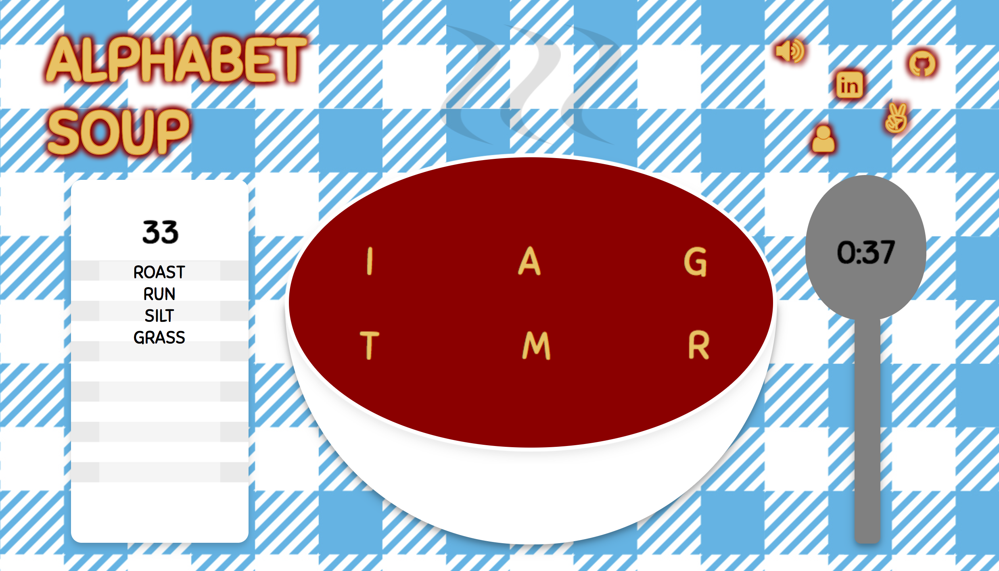

# Alphabet Soup

[Play](http://www.amandachen.io/Alphabet-Soup/)

Alphabet Soup is a letter-unscrambling word game, built with JavaScript, jQuery, and HTML5 Canvas.



## Gameplay

When a player starts the game, six randomly generated letters will appear in a bowl of alphabet soup and the one minute timer will start to count down. The player will type and enter a word using two to six of these letters. If the word is valid, new letters will replace the ones used. The word will be added to a list of found words and points will be added to the score depending on the length, with bonuses awarded for keeping a streak going. If the word is not valid, the same letters will return to the bowl. The player can choose to press the space bar to generate a new set of letters. When time is up, the player's final score and the top ten high scores will pop up. The player can then submit their name and score or play again.

## Implementation

### Dictionary Lookup

A trie structure was built from a large dictionary text file containing 30,000 words in order to optimize word validation. Each node of the trie represents a letter and tracks any child nodes representing possible subsequent letters. When a word is submitted, the dictionary trie will look at the root node for the first letter. Then, it will look at its children for the next letter, and so on. If the next letter is not found, the word is invalid. Lookup is O(1), where the worst case is for a six-letter word.

```javascript
class Trie {
  constructor() {
    this.root = new TrieNode("");
  }

  insert(word) {
    let currentNode = this.root;

    for (let i = 0; i < word.length; i ++) {
      let char = word[i];
      if (currentNode.children[char]) {
        currentNode = currentNode.children[char];
      } else {
        let newChild = new TrieNode(char);
        currentNode.addChild(newChild);
        currentNode = newChild;
      }
    }
    currentNode.isValidWord = true;
  }

  isValidWord(word) {
    let currentNode = this.root;

    for (let i = 0; i < word.length; i ++) {
      let char = word[i];
      if (currentNode.children[char]) {
        currentNode = currentNode.children[char];
      } else {
        return false;
      }
    }
    return currentNode.isValidWord;
  }
}

class TrieNode {
  constructor(char) {
    this.char = char;
    this.children = {};
    this.isValidWord = false;
  }
  addChild(node) {
    this.children[node.char] = node;
  }
}
```

### ANOTHER FEATURE

### High Scores

Player names and scores are stored in a Firebase realtime database and persist between sessions and different computers. At the end of the game, the top ten high scores are displayed and the player has the option to submit their name and score.

```javascript
// submits player name and score
let newScore = firebase.database().ref("scores").push();
window.newScore = newScore;
game.username = $("#username").val();
if (game.username) {
  newScore.set({username: game.username, score: game.score});
} else {
  newScore.set({username: "User", score: game.score});
}

// fetches and displays top ten high scores
var scoresTable = firebase.database().ref("scores");
scoresTable.orderByChild("score").limitToLast(10).on('value', (snapshot, highscores) => {
  $(".usernames li").remove();
  $(".scores li").remove();
  highscores = [];
  snapshot.forEach(childSnapshot => {
    highscores.push((childSnapshot.val()));
  });
  highscores.reverse();
  for (let i = 0; i < highscores.length; i++) {
    let $li = $('<li>');
    $(".usernames").append($li.text(`${highscores[i].username}`));
  }
  for (let i = 0; i < highscores.length; i++) {
    let $li = $('<li>');
    $(".scores").append($li.text(`${highscores[i].score}`));
  }
});
```
